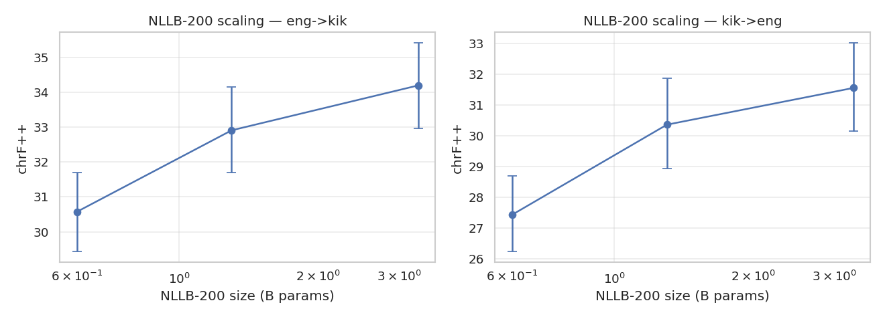
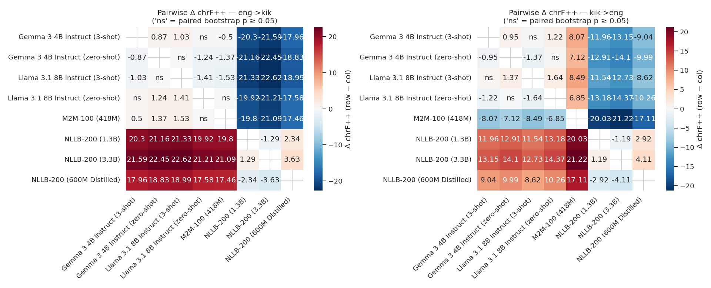
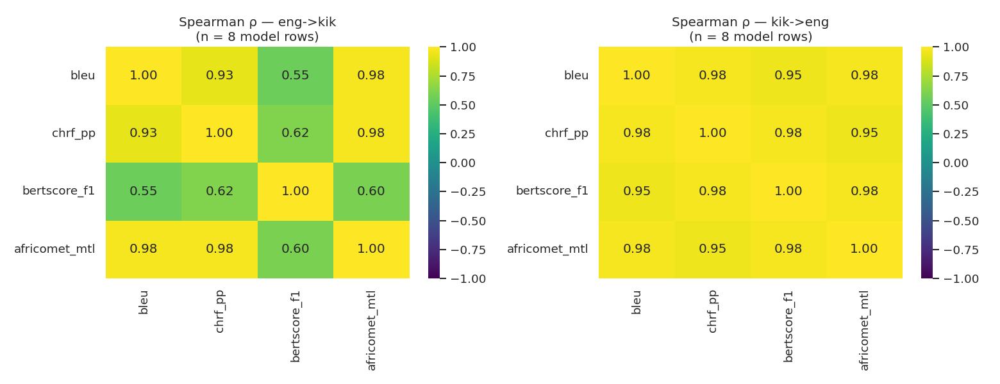
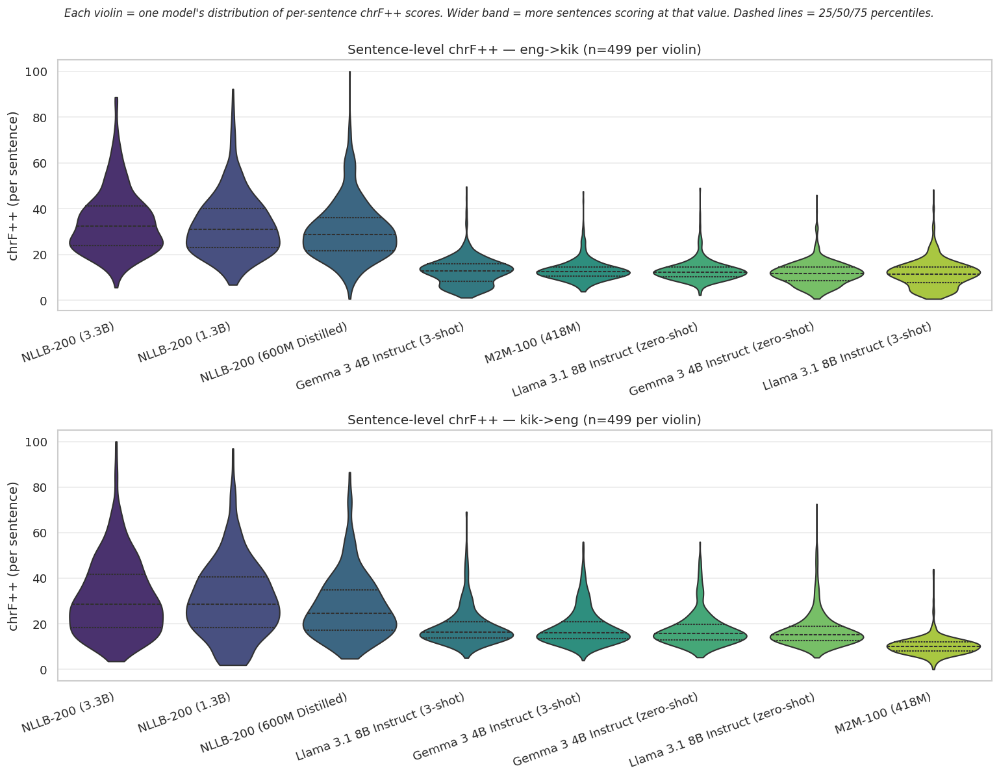
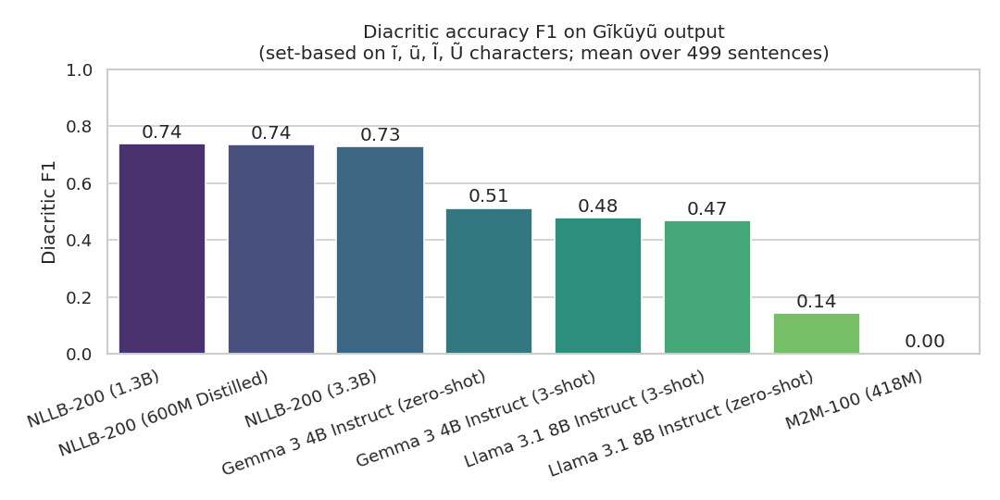
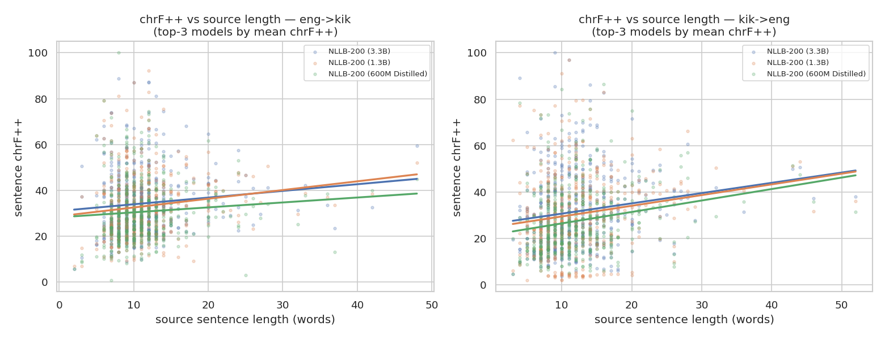
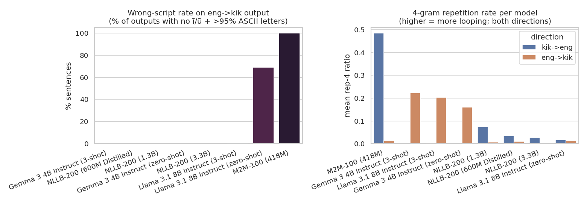
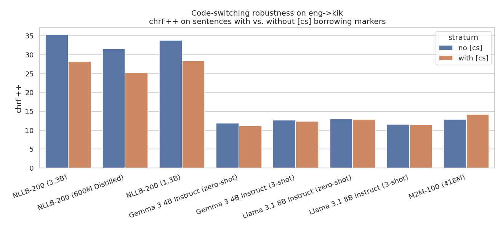

# Gĩkũyũ MT Benchmark — Final Report

*Run: `benchmark_20260508_063320` — analysed by [`analysis.ipynb`](../analysis.ipynb)*

Test set: **499 sentence pairs** from the GAC agricultural corpus, both directions (eng→kik, kik→eng).
Hardware: 2× NVIDIA consumer GPUs (RTX 3060 12 GB + RTX 2080 Ti 11 GB), 1.5 TB RAM, 32-core Xeon.
Significance tests: 5 000-sample paired bootstrap on sentence-level chrF++ (Koehn 2004).

## TL;DR

- **NLLB-200 dominates.** Even the 600M distilled checkpoint beats every LLM by 9–18 chrF++.
- **NLLB scaling is real.** All five 600M→1.3B→3.3B increments significant at p ≤ 0.02.
- **Few-shot is direction-dependent.** Llama-3.1 eng→kik *regresses* by 1.4 chrF++ (p < 0.001) but its diacritic F1 *triples* (0.15 → 0.47).
- **The LLM chrF++ floor is hallucination, not partial competence.** Llama zero-shot eng→kik is 68.9% wrong-script; Gemma 3-shot has 22% repeated 4-grams.
- **Only NLLB learnt Gĩkũyũ orthography.** Diacritic F1: NLLB ≈ 0.74, Gemma/Llama 3-shot ≈ 0.47, M2M-100 = 0.004.
- **Code-switching markers cost NLLB 5–7 chrF++** (p < 0.001); LLMs show no CS sensitivity because their baseline is already at the floor.
- **chrF++ and AfriCOMET disagree on the per-sentence winner 60% of the time.** Recommendation: report both, not one.
- **BERTScore disagrees with chrF++/AfriCOMET on eng→kik** (Spearman ρ ≈ 0.6 vs 0.98).
- **Two models could not run on consumer GPUs** (`kikuyu-translator-final`, Aya-101) — itself a finding.

## Table 4: eng->kik (sorted by chrF++)

| Model                             |   BLEU |   chrF++ | chrF++ 95% CI   |   BERTScore F1 |   AfriCOMET-MTL |   Perplexity |   Speed (tok/s) |
|:----------------------------------|-------:|---------:|:----------------|---------------:|----------------:|-------------:|----------------:|
| NLLB-200 (3.3B)                   |   8.42 |    34.20 | [32.97, 35.45]  |           0.80 |            0.36 |       220.25 |           22.34 |
| NLLB-200 (1.3B)                   |   6.87 |    32.91 | [31.71, 34.14]  |           0.80 |            0.35 |       196.88 |           38.60 |
| NLLB-200 (600M Distilled)         |   5.47 |    30.57 | [29.47, 31.71]  |           0.79 |            0.33 |       211.79 |           96.71 |
| M2M-100 (418M)                    |   1.16 |    13.11 | [12.70, 13.54]  |           0.59 |            0.27 |      1524.99 |          247.41 |
| Llama 3.1 8B Instruct (zero-shot) |   0.93 |    12.99 | [12.60, 13.40]  |           0.61 |            0.14 |      1451.22 |            7.02 |
| Gemma 3 4B Instruct (3-shot)      |   0.55 |    12.61 | [12.09, 13.16]  |           0.70 |           -0.01 |       864.35 |            2.02 |
| Gemma 3 4B Instruct (zero-shot)   |   0.51 |    11.75 | [11.30, 12.21]  |           0.70 |           -0.03 |       741.39 |            1.99 |
| Llama 3.1 8B Instruct (3-shot)    |   0.63 |    11.58 | [11.05, 12.12]  |           0.68 |           -0.02 |       489.83 |            3.30 |

## Table 5: kik->eng (sorted by chrF++)

| Model                             |   BLEU |   chrF++ | chrF++ 95% CI   |   BERTScore F1 |   AfriCOMET-MTL |   Perplexity |   Speed (tok/s) |
|:----------------------------------|-------:|---------:|:----------------|---------------:|----------------:|-------------:|----------------:|
| NLLB-200 (3.3B)                   |   7.28 |    31.55 | [30.07, 33.03]  |           0.78 |            0.42 |          nan |           27.91 |
| NLLB-200 (1.3B)                   |   3.96 |    30.36 | [28.91, 31.81]  |           0.77 |            0.39 |          nan |           34.25 |
| NLLB-200 (600M Distilled)         |   5.50 |    27.44 | [26.19, 28.68]  |           0.76 |            0.31 |          nan |          100.66 |
| Llama 3.1 8B Instruct (3-shot)    |   3.20 |    18.82 | [18.07, 19.60]  |           0.72 |            0.22 |          nan |           15.17 |
| Gemma 3 4B Instruct (3-shot)      |   2.45 |    18.40 | [17.72, 19.10]  |           0.71 |            0.21 |          nan |            1.09 |
| Gemma 3 4B Instruct (zero-shot)   |   2.15 |    17.45 | [16.83, 18.12]  |           0.69 |            0.16 |          nan |            1.31 |
| Llama 3.1 8B Instruct (zero-shot) |   2.43 |    17.18 | [16.51, 17.90]  |           0.69 |            0.19 |          nan |           15.85 |
| M2M-100 (418M)                    |   0.43 |    10.33 | [9.96, 10.73]   |           0.61 |           -0.26 |          nan |           88.52 |

## NLLB-200 scaling — paired bootstrap p-values

### eng->kik

| model                     |   chrf_pp |   ci_lo |   ci_hi |   n |
|:--------------------------|----------:|--------:|--------:|----:|
| NLLB-200 (600M Distilled) |     30.57 |   29.48 |   31.69 | 499 |
| NLLB-200 (1.3B)           |     32.91 |   31.76 |   34.14 | 499 |
| NLLB-200 (3.3B)           |     34.20 |   33.03 |   35.46 | 499 |

| a                         | b               |   delta_chrf_pp |   p_value |
|:--------------------------|:----------------|----------------:|----------:|
| NLLB-200 (600M Distilled) | NLLB-200 (1.3B) |          -2.339 |     0.000 |
| NLLB-200 (600M Distilled) | NLLB-200 (3.3B) |          -3.627 |     0.000 |
| NLLB-200 (1.3B)           | NLLB-200 (3.3B) |          -1.288 |     0.000 |

### kik->eng

| model                     |   chrf_pp |   ci_lo |   ci_hi |   n |
|:--------------------------|----------:|--------:|--------:|----:|
| NLLB-200 (600M Distilled) |     27.44 |   26.23 |   28.70 | 499 |
| NLLB-200 (1.3B)           |     30.36 |   28.90 |   31.76 | 499 |
| NLLB-200 (3.3B)           |     31.55 |   30.15 |   32.98 | 499 |

| a                         | b               |   delta_chrf_pp |   p_value |
|:--------------------------|:----------------|----------------:|----------:|
| NLLB-200 (600M Distilled) | NLLB-200 (1.3B) |          -2.923 |     0.000 |
| NLLB-200 (600M Distilled) | NLLB-200 (3.3B) |          -4.115 |     0.000 |
| NLLB-200 (1.3B)           | NLLB-200 (3.3B) |          -1.192 |     0.020 |

## Zero-shot vs 3-shot deltas

| family    | direction   |   zero_chrf_pp |   three_chrf_pp |   delta |   p_value |   n |
|:----------|:------------|---------------:|----------------:|--------:|----------:|----:|
| Llama 3.1 | eng->kik    |         12.989 |          11.584 |  -1.405 |     0.000 | 499 |
| Gemma 3   | eng->kik    |         11.746 |          12.612 |   0.866 |     0.000 | 499 |
| Llama 3.1 | kik->eng    |         17.177 |          18.819 |   1.642 |     0.000 | 499 |
| Gemma 3   | kik->eng    |         17.448 |          18.396 |   0.948 |     0.000 | 499 |

**Llama-3.1 eng→kik 3-shot regresses by 1.4 chrF++ (p < 0.001).** All other (family, direction) pairs benefit from 3-shot examples.

---
## Novel deep-dive analyses (§13 of the notebook)

### Diacritic accuracy (eng→kik) — set-based F1 on ĩ ũ Ĩ Ũ

| model                             |   diacritic_p |   diacritic_r |   diacritic_f1 |   ref_diac_per_sent |   hyp_diac_per_sent |
|:----------------------------------|--------------:|--------------:|---------------:|--------------------:|--------------------:|
| NLLB-200 (1.3B)                   |         0.715 |         0.843 |          0.738 |               9.142 |              11.261 |
| NLLB-200 (600M Distilled)         |         0.705 |         0.854 |          0.737 |               9.142 |              11.735 |
| NLLB-200 (3.3B)                   |         0.689 |         0.855 |          0.728 |               9.142 |              11.683 |
| Gemma 3 4B Instruct (zero-shot)   |         0.444 |         0.880 |          0.513 |               9.142 |              36.313 |
| Gemma 3 4B Instruct (3-shot)      |         0.374 |         0.931 |          0.478 |               9.142 |              46.345 |
| Llama 3.1 8B Instruct (3-shot)    |         0.380 |         0.863 |          0.468 |               9.142 |              43.477 |
| Llama 3.1 8B Instruct (zero-shot) |         0.248 |         0.138 |          0.145 |               9.142 |               2.146 |
| M2M-100 (418M)                    |         0.004 |         0.004 |          0.004 |               9.142 |               0.000 |

### Length effect — OLS chrF++ ~ source words

| direction   | model                             |   slope_chrfpp_per_word |   intercept |   pearson_r |   p_value |   n |
|:------------|:----------------------------------|------------------------:|------------:|------------:|----------:|----:|
| eng->kik    | Gemma 3 4B Instruct (3-shot)      |                   0.023 |      12.349 |       0.019 |     0.670 | 499 |
| eng->kik    | Gemma 3 4B Instruct (zero-shot)   |                   0.025 |      11.464 |       0.024 |     0.592 | 499 |
| eng->kik    | Llama 3.1 8B Instruct (3-shot)    |                   0.140 |      10.005 |       0.115 |     0.010 | 499 |
| eng->kik    | NLLB-200 (600M Distilled)         |                   0.216 |      28.144 |       0.083 |     0.063 | 499 |
| eng->kik    | Llama 3.1 8B Instruct (zero-shot) |                   0.250 |      10.175 |       0.270 |     0.000 | 499 |
| eng->kik    | M2M-100 (418M)                    |                   0.274 |      10.033 |       0.288 |     0.000 | 499 |
| eng->kik    | NLLB-200 (3.3B)                   |                   0.292 |      30.919 |       0.104 |     0.020 | 499 |
| eng->kik    | NLLB-200 (1.3B)                   |                   0.381 |      28.629 |       0.138 |     0.002 | 499 |
| kik->eng    | M2M-100 (418M)                    |                   0.036 |       9.887 |       0.049 |     0.273 | 499 |
| kik->eng    | NLLB-200 (3.3B)                   |                   0.443 |      26.175 |       0.156 |     0.000 | 499 |
| kik->eng    | NLLB-200 (1.3B)                   |                   0.462 |      24.758 |       0.164 |     0.000 | 499 |
| kik->eng    | NLLB-200 (600M Distilled)         |                   0.494 |      21.438 |       0.206 |     0.000 | 499 |
| kik->eng    | Llama 3.1 8B Instruct (3-shot)    |                   0.540 |      12.268 |       0.372 |     0.000 | 499 |
| kik->eng    | Gemma 3 4B Instruct (zero-shot)   |                   0.561 |      10.638 |       0.437 |     0.000 | 499 |
| kik->eng    | Gemma 3 4B Instruct (3-shot)      |                   0.561 |      11.583 |       0.412 |     0.000 | 499 |
| kik->eng    | Llama 3.1 8B Instruct (zero-shot) |                   0.562 |      10.358 |       0.413 |     0.000 | 499 |

### Length ratio — pred / ref words

| direction   | model                             |   length_ratio |   mean_pred_words |   mean_ref_words |
|:------------|:----------------------------------|---------------:|------------------:|-----------------:|
| eng->kik    | M2M-100 (418M)                    |          1.050 |            12.745 |           12.134 |
| eng->kik    | NLLB-200 (3.3B)                   |          1.147 |            13.922 |           12.134 |
| eng->kik    | NLLB-200 (1.3B)                   |          1.174 |            14.240 |           12.134 |
| eng->kik    | Llama 3.1 8B Instruct (zero-shot) |          1.181 |            14.333 |           12.134 |
| eng->kik    | NLLB-200 (600M Distilled)         |          1.216 |            14.752 |           12.134 |
| eng->kik    | Llama 3.1 8B Instruct (3-shot)    |          1.789 |            21.713 |           12.134 |
| eng->kik    | Gemma 3 4B Instruct (zero-shot)   |          1.949 |            23.649 |           12.134 |
| eng->kik    | Gemma 3 4B Instruct (3-shot)      |          2.163 |            26.244 |           12.134 |
| kik->eng    | Gemma 3 4B Instruct (3-shot)      |          1.261 |            14.180 |           11.246 |
| kik->eng    | Llama 3.1 8B Instruct (3-shot)    |          1.290 |            14.503 |           11.246 |
| kik->eng    | Gemma 3 4B Instruct (zero-shot)   |          1.400 |            15.739 |           11.246 |
| kik->eng    | NLLB-200 (600M Distilled)         |          1.440 |            16.196 |           11.246 |
| kik->eng    | NLLB-200 (3.3B)                   |          1.496 |            16.824 |           11.246 |
| kik->eng    | Llama 3.1 8B Instruct (zero-shot) |          1.587 |            17.844 |           11.246 |
| kik->eng    | M2M-100 (418M)                    |          2.310 |            25.984 |           11.246 |
| kik->eng    | NLLB-200 (1.3B)                   |          2.381 |            26.778 |           11.246 |

### Hallucination + repetition

| direction   | model                             |   empty_pct |   english_lookalike_pct |   mean_rep4 |   max_rep4 |
|:------------|:----------------------------------|------------:|------------------------:|------------:|-----------:|
| eng->kik    | M2M-100 (418M)                    |       0.000 |                 100.000 |       0.013 |      0.846 |
| eng->kik    | Llama 3.1 8B Instruct (zero-shot) |       0.000 |                  68.938 |       0.014 |      0.949 |
| eng->kik    | Llama 3.1 8B Instruct (3-shot)    |       0.000 |                   0.802 |       0.203 |      0.967 |
| eng->kik    | NLLB-200 (1.3B)                   |       0.000 |                   0.401 |       0.006 |      0.914 |
| eng->kik    | NLLB-200 (3.3B)                   |       0.000 |                   0.401 |       0.002 |      0.789 |
| eng->kik    | Gemma 3 4B Instruct (zero-shot)   |       0.000 |                   0.401 |       0.161 |      0.964 |
| eng->kik    | NLLB-200 (600M Distilled)         |       0.000 |                   0.200 |       0.011 |      0.976 |
| eng->kik    | Gemma 3 4B Instruct (3-shot)      |       0.000 |                   0.000 |       0.223 |      0.967 |
| kik->eng    | NLLB-200 (600M Distilled)         |       0.000 |                 nan     |       0.034 |      0.922 |
| kik->eng    | NLLB-200 (1.3B)                   |       0.000 |                 nan     |       0.075 |      0.906 |
| kik->eng    | NLLB-200 (3.3B)                   |       0.000 |                 nan     |       0.026 |      0.931 |
| kik->eng    | M2M-100 (418M)                    |       0.200 |                 nan     |       0.486 |      0.971 |
| kik->eng    | Llama 3.1 8B Instruct (zero-shot) |       0.000 |                 nan     |       0.017 |      0.750 |
| kik->eng    | Llama 3.1 8B Instruct (3-shot)    |       0.000 |                 nan     |       0.003 |      0.317 |
| kik->eng    | Gemma 3 4B Instruct (zero-shot)   |       0.000 |                 nan     |       0.003 |      0.424 |
| kik->eng    | Gemma 3 4B Instruct (3-shot)      |       0.000 |                 nan     |       0.000 |      0.147 |

### Code-switching robustness ([cs] vs no-[cs] strata)

| direction   | model                             |   n_cs |   n_no_cs |   chrfpp_no_cs |   chrfpp_with_cs |   delta |   p_value |
|:------------|:----------------------------------|-------:|----------:|---------------:|-----------------:|--------:|----------:|
| eng->kik    | NLLB-200 (3.3B)                   |     79 |       420 |         35.332 |           28.178 |  -7.154 |     0.000 |
| eng->kik    | NLLB-200 (600M Distilled)         |     79 |       420 |         31.574 |           25.252 |  -6.322 |     0.000 |
| eng->kik    | NLLB-200 (1.3B)                   |     79 |       420 |         33.765 |           28.375 |  -5.390 |     0.000 |
| eng->kik    | Gemma 3 4B Instruct (zero-shot)   |     79 |       420 |         11.855 |           11.168 |  -0.687 |     0.275 |
| eng->kik    | Gemma 3 4B Instruct (3-shot)      |     79 |       420 |         12.657 |           12.374 |  -0.283 |     0.700 |
| eng->kik    | Llama 3.1 8B Instruct (zero-shot) |     79 |       420 |         13.014 |           12.855 |  -0.159 |     0.782 |
| eng->kik    | Llama 3.1 8B Instruct (3-shot)    |     79 |       420 |         11.606 |           11.462 |  -0.144 |     0.840 |
| eng->kik    | M2M-100 (418M)                    |     79 |       420 |         12.916 |           14.161 |   1.246 |     0.055 |

### Per-sentence chrF++/AfriCOMET winner agreement

| direction   |   n_sentences |   agreement_rate_pct |
|:------------|--------------:|---------------------:|
| eng->kik    |           499 |                 33.7 |
| kik->eng    |           499 |                 41.9 |

## Hardware-skipped models

| Model | Reason |
|---|---|
| `kikuyu-translator-final` (Gemma-3n-E4B LoRA) | Base model `unsloth/gemma-3n-e4b-it-unsloth-bnb-4bit` (multimodal Gemma-3n). Vision/audio towers cannot be quantised further (already nf4); exceed VRAM headroom on dual-11 GB GPUs. |
| Aya-101 (13 B mT5) | INT8 weights ~13 GB; concurrent users on GPU 0 leave too little headroom; CPU offload OOM during forward pass. CPU-only fp32 inference would have taken 17–33 h. |

Both decisions are documented in [`config/models.yaml`](../../config/models.yaml).

## Plots

### `nllb_scaling.png`

*NLLB-200 chrF++ vs parameter count, both directions, with 95% bootstrap CIs.*

### `pairwise_significance.png`

*All-pairs Δ chrF++ heatmap; cells marked 'ns' fail paired bootstrap p < 0.05.*

### `metric_correlations.png`

*Spearman ρ between BLEU, chrF++, BERTScore F1, AfriCOMET-MTL across the 8 model rows.*

### `sentence_chrf_violin.png`

*Sentence-level chrF++ distributions per model, both directions.*

### `diacritic_accuracy.png`

*Set-based F1 on ĩ ũ Ĩ Ũ characters per model on eng→kik output.*

### `length_effect.png`

*chrF++ vs source sentence length — top-3 models per direction with OLS lines.*

### `hallucination_repetition.png`

*Wrong-script rate (left) and 4-gram repetition rate (right) per model.*

### `code_switching.png`

*chrF++ on sentences with vs without [cs] borrowing markers.*

## Findings (full prose)

See sections §12 and §14 of [`analysis.ipynb`](../../analysis.ipynb) for the evidence-by-question writeup.
